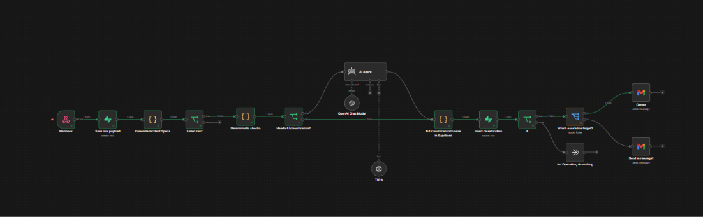
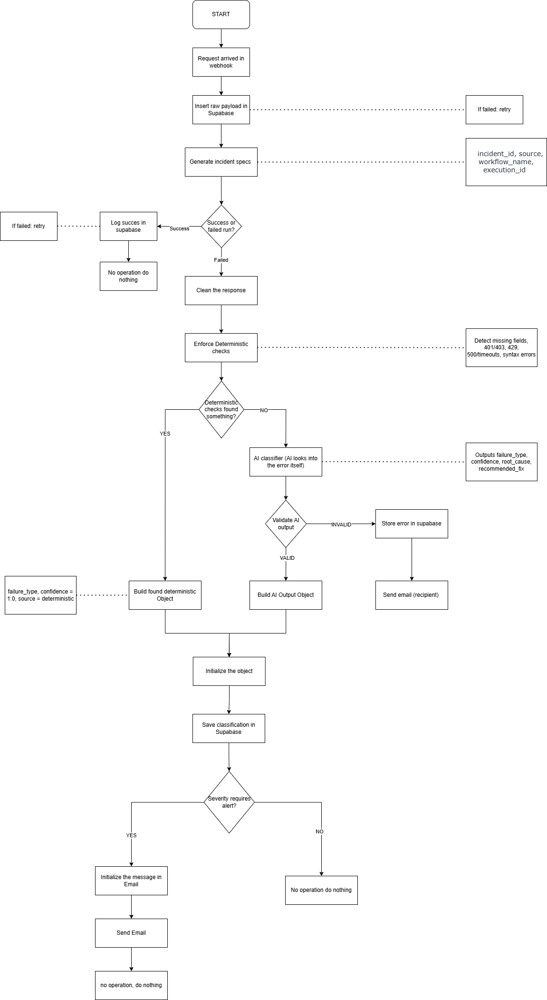
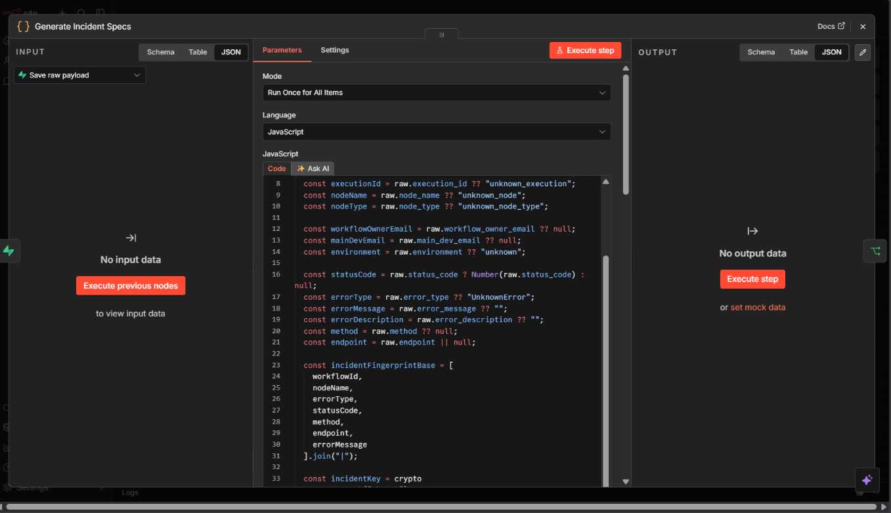
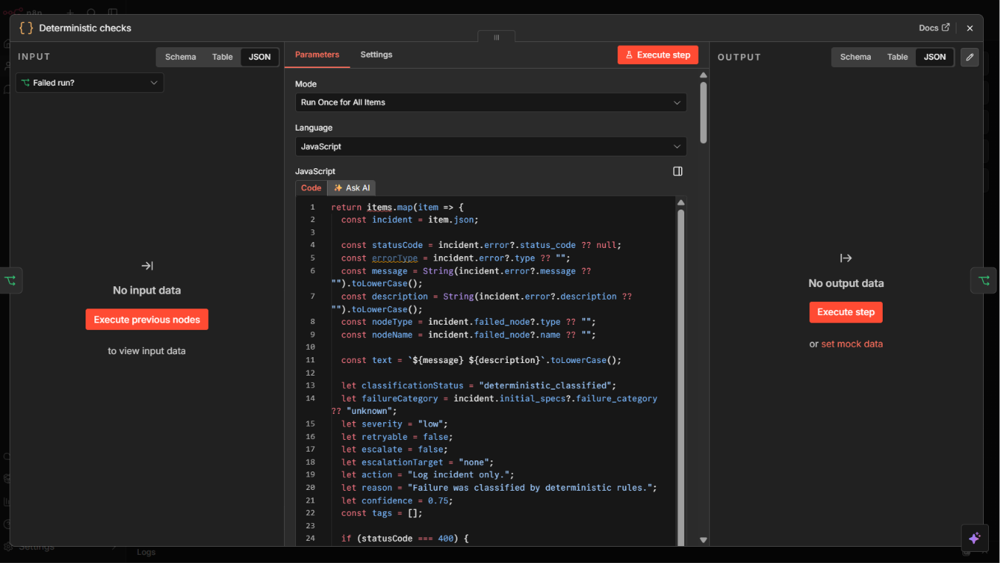
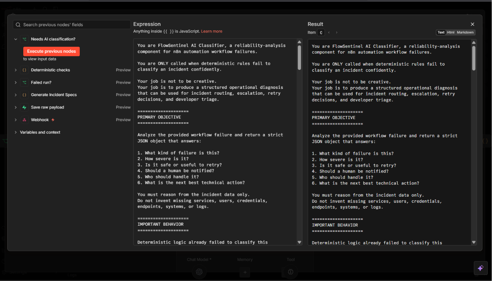
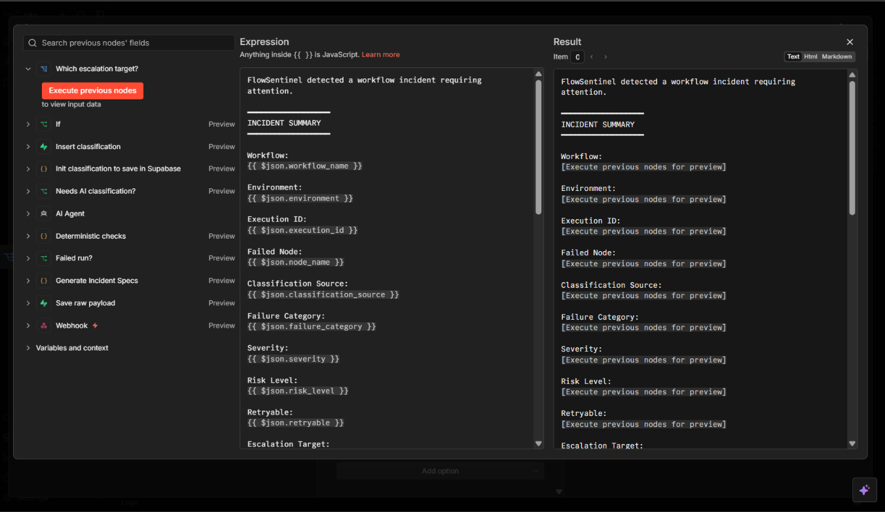
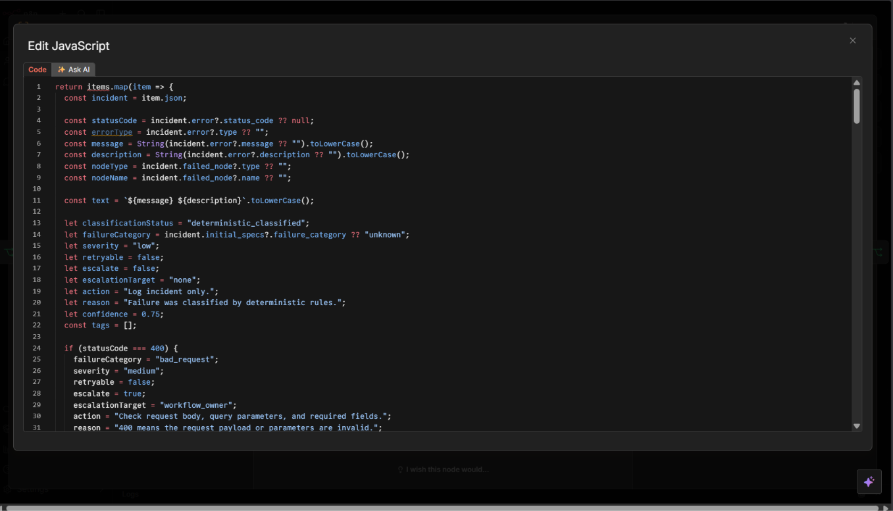

# FlowSentinel

## AI-Assisted Reliability & Incident Classification Engine for n8n Workflows

<p align="center">
  
</p>

---

# Table of Contents

1. What is FlowSentinel?
2. Problem It Solves
3. Architecture Diagram
4. Workflow Pipeline
5. Deterministic vs AI Layer
6. Incident Lifecycle
7. Tech Stack
8. Sample Incident Payload
9. Database Structure
10. Sample Incident Notification
11. Future V2 Roadmap
12. Screenshots

---

# 1. What is FlowSentinel?

FlowSentinel is an AI-assisted reliability and incident classification engine designed for automation workflows built in n8n.

It acts as an external observability layer that monitors failed workflow executions, classifies incidents through deterministic logic with AI fallback analysis, persists operational telemetry into Supabase, and escalates actionable failures to workflow owners or main developers through automated notifications.

The project was designed around one core principle:

> Deterministic systems should handle reliability-critical decisions, while AI should assist only when deterministic logic cannot confidently classify an incident.

FlowSentinel operates independently from the workflows it monitors, allowing it to function as an isolated reliability engine rather than a self-contained error handler embedded directly inside production automations.

---

# 2. Problem It Solves

Modern automation workflows frequently fail due to:

* invalid API requests
* expired credentials
* malformed payloads
* schema mismatches
* rate limits
* infrastructure instability
* webhook delivery failures
* inconsistent data shapes
* orchestration logic errors

Most low-code orchestration environments provide raw execution logs but lack:

* centralized incident management
* structured failure classification
* escalation routing
* retryability analysis
* ownership-aware notifications
* operational observability

This creates several operational problems:

## Operational Blind Spots

Failures may occur silently without notifying the responsible developer.

## Difficult Debugging

Raw execution logs are often noisy, inconsistent, and difficult to analyze quickly.

## Lack of Incident Prioritization

Not every failure deserves escalation, but critical incidents should immediately notify developers.

## AI Reliability Risks

AI-generated automation pipelines can introduce ambiguous or unpredictable failures that require additional interpretation.

FlowSentinel addresses these problems by converting raw workflow failures into structured operational incidents.

---

# 3. Architecture Diagram

```text
Failing Workflow Environment
        ↓
n8n Error Trigger
        ↓
POST Request to FlowSentinel
        ↓
FlowSentinel Webhook Intake
        ↓
Raw Payload Persistence (Supabase)
        ↓
Incident Spec Generation
        ↓
Deterministic Classification Engine
        ↓
IF Deterministic Match Found
    → Save Classified Incident
    → Notify Responsible Owner

ELSE
    → AI Incident Classification
    → Save Classified Incident
    → Notify Responsible Owner
```

---

## Architecture Screenshot 




---

# 4. Workflow Pipeline

## Step 1 — Failed Workflow Execution

A monitored workflow intentionally or unintentionally fails inside a separate n8n environment.

Example failures:

* invalid endpoint
* OAuth expiration
* malformed JSON
* failed HTTP requests
* missing data fields

---

## Step 2 — Error Trigger Capture

The workflow’s Error Trigger captures the failed execution metadata and forwards it to FlowSentinel through an HTTP POST request.

Payload includes:

* workflow metadata
* execution metadata
* failed node information
* error details
* environment
* ownership metadata

---

## Step 3 — Raw Payload Persistence

The incoming incident is persisted into a raw incident table inside Supabase.

Purpose:

* preserve the original failure payload
* provide auditability
* support future replay/debugging
* maintain historical incident records

---

## Step 4 — Incident Spec Generation

The “Generate Incident Specs” layer transforms raw workflow failures into normalized operational incident objects.

This stage:

* standardizes inconsistent failure payloads
* derives structured incident metadata
* generates incident fingerprints
* prepares context for deterministic and AI classification

### Responsibilities of Incident Spec Generation

#### Normalization

Converts raw workflow failures into a consistent schema.

Example:

* convert status codes into integers
* standardize workflow metadata
* normalize node information
* clean inconsistent payload structures

#### Incident Fingerprinting

Generates a unique incident key using:

* workflow ID
* node name
* error type
* status code
* endpoint
* error message

This enables:

* incident deduplication
* future retry tracking
* operational grouping

#### Initial Classification Hints

Provides lightweight pre-analysis:

* likely retryability
* initial failure category
* environment context

#### AI Context Preparation

Creates structured contextual summaries optimized for downstream AI reasoning.

---

## Incident Spec Generation Screenshot




---

## Step 5 — Deterministic Classification Engine

The deterministic engine acts as the primary reliability layer.

Instead of relying on AI for all decisions, FlowSentinel first attempts to classify incidents through explicit rule-based operational logic.

### Why Deterministic First?

Operational reliability should remain:

* predictable
* explainable
* auditable
* consistent

Deterministic rules are ideal for:

* known HTTP status codes
* authentication failures
* rate limits
* malformed payloads
* network failures
* schema mismatches
* validation issues

### Deterministic Classification Responsibilities

The engine determines:

* failure category
* severity
* retryability
* escalation necessity
* escalation target
* recommended action

### Example Rules

#### 404

```text
Category: not_found
Retryable: false
Escalate: true
Target: workflow_owner
```

#### 429

```text
Category: rate_limit
Retryable: true
Escalate: false
```

#### Credential Errors

```text
Category: credential_or_oauth_error
Severity: high
Escalate: true
Target: main_devs
```

### Escalation Guardrails

The deterministic layer also applies:

* environment-aware escalation
* critical keyword detection
* ownership-aware routing
* notification path generation

---

## Deterministic Engine Screenshot




---

## Step 6 — AI Classification Fallback

If deterministic rules cannot confidently classify an incident, the incident is routed into the AI classification layer.

The AI layer:

* analyzes ambiguous failures
* infers likely operational causes
* estimates severity
* proposes remediation steps
* determines escalation needs

AI is intentionally used as:

> an operational reasoning fallback layer

rather than the primary reliability engine.

---

## AI Classification Screenshot 




---

## Step 7 — Classified Incident Persistence

Classified incidents are persisted into a second structured Supabase table.

Stored data includes:

* classification source
* failure category
* retryability
* escalation routing
* AI reasoning
* operational metadata
* incident relationships

---

## Step 8 — Notification Routing

If escalation is required, FlowSentinel automatically determines:

* who should receive the alert
* whether email notification is necessary
* which escalation path should execute

Targets include:

* workflow owners
* main developers

---

## Email Notification Screenshot 




---

# 5. Deterministic vs AI Layer

One of the central architectural principles behind FlowSentinel is the separation between deterministic operational logic and AI reasoning.

## Deterministic Layer

Used for:

* exact operational rules
* known error patterns
* retry safety decisions
* escalation routing
* predictable classifications

Advantages:

* reliable
* auditable
* repeatable
* low hallucination risk

---

## AI Layer

Used only when deterministic logic cannot confidently classify an incident.

Used for:

* ambiguous failures
* unstructured error reasoning
* inferred operational diagnosis
* contextual remediation suggestions

Advantages:

* flexible
* adaptive
* capable of handling unknown failure patterns

This separation prevents AI from directly controlling operationally sensitive workflow decisions.

---

# 6. Incident Lifecycle

```text
Workflow Failure
    ↓
Error Trigger Capture
    ↓
Payload Ingestion
    ↓
Raw Incident Storage
    ↓
Incident Spec Generation
    ↓
Deterministic Classification
    ↓
AI Fallback (if necessary)
    ↓
Classified Incident Storage
    ↓
Escalation Routing
    ↓
Email Notification
```

---

# 7. Tech Stack

## Core Technologies

* n8n
* Supabase
* OpenAI API
* JavaScript
* PostgreSQL

## Key Components

### n8n

Handles:

* workflow orchestration
* webhook ingestion
* routing
* notification handling

### Supabase

Handles:

* incident persistence
* structured operational storage
* classified incident management

### OpenAI

Handles:

* AI fallback classification
* contextual incident analysis
* remediation suggestions

---

# 8. Sample Incident Payload

```json
{
  "workflow_name": "HubSpot Lead Sync",
  "workflow_id": "abc123",
  "execution_id": "91",
  "node_name": "HTTP Request",
  "error_type": "NodeApiError",
  "status_code": 404,
  "error_message": "The resource you are requesting could not be found",
  "method": "GET",
  "environment": "production",
  "workflow_owner_email": "owner@company.com",
  "main_dev_email": "devs@company.com"
}
```

---

# 9. Database Structure

## Raw Incident Table

Stores:

* raw payloads
* execution metadata
* ownership metadata
* incident fingerprints

Purpose:

* auditing
* replayability
* debugging
* historical records

---

## Classified Incident Table

Stores:

* deterministic classifications
* AI classifications
* retryability
* escalation routing
* operational severity
* notification metadata

Purpose:

* operational observability
* incident tracking
* escalation handling
* analytics

---

# 10. Sample Incident Notification

## Subject


[FlowSentinel][HIGH] authentication_error in HubSpot Lead Sync

## Body

```text
FlowSentinel detected a workflow incident requiring attention.

Workflow: HubSpot Lead Sync
Environment: production
Severity: high
Category: authentication_error

Recommended Action:
Check expired credentials, API keys, OAuth scopes, and token refresh handling.
```

---

# 11. Future Improvements Roadmap

Planned future improvements include:

## Retry Orchestration

Intelligent retry handling with retry-state awareness.

---

## Incident Deduplication

Automatic grouping of repeated operational failures.

---

## Workflow Registry

Centralized workflow ownership and escalation management.

---

## Slack / Discord Integrations

Multi-channel operational alerting.

---

## Incident Analytics Dashboard

Operational metrics and workflow health visualization.

---

## Replay-Safe Recovery

Exploration of partial execution recovery and replay safety.

---

## State Persistence

Tracking workflow state transitions across failures and retries.

---

## Retry Intelligence

Adaptive retry policies based on:

* incident category
* severity
* operational risk
* historical reliability patterns

---

# 12. Screenshots

## Workflow Architecture


---

## Flowchart


---

## Deterministic Checks




---

## AI Classification


---

## Incident Email


---

# Conclusion

FlowSentinel demonstrates an approach to automation reliability where:

* deterministic operational logic remains authoritative
* AI serves as a controlled reasoning fallback
* workflow failures become structured operational incidents
* ownership-aware escalation improves observability and response time

The project focuses on operational reliability, incident intelligence, and workflow observability for AI-assisted automation systems.
